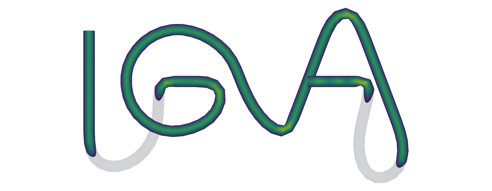
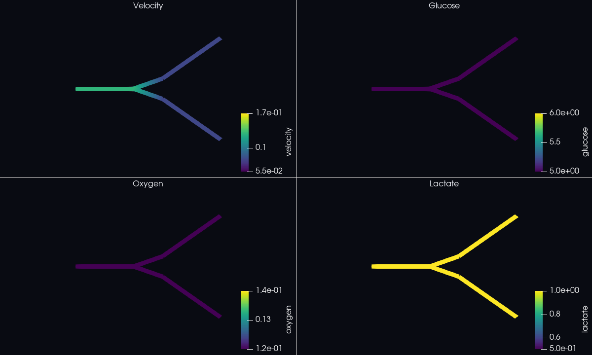

<p align="center">
  
</p>

# CoupledFlow

CoupledFlow is a C++ framework for coupled flow and transport across 0D, 1D,
and 3D domains. The project began as TubularFlowIGA; the repository URL keeps
that original name for compatibility with existing citations and links.

The framework combines lumped circuits, vascular network models,
tetrahedral finite elements, and isogeometric analysis (IGA). CPU solvers use
MPI and PETSc, while the body-fitted IGA backend also supports a single CUDA
GPU. The same runtime infrastructure supports named-domain coupling,
checkpoint/restart, conservative species transfer, moving domains, and
selected fluid--structure interaction workflows.

CoupledFlow is research software. The supported numerical models and their
validation evidence are documented in [Benchmarks](docs/BENCHMARKS.md) and the
[technology matrix](TECHNOLOGY_MATRIX.md).

## Capabilities

| Area | Available implementations |
|---|---|
| 0D flow | R, RC, RLC, and RCR circuits; source reservoirs; selected closed-loop VCA models |
| 1D flow | Rigid Poiseuille and inertance networks; compliant A/Q formulations; explicit and PETSc implicit solvers |
| 3D flow | Body-fitted IGA Navier--Stokes on CPU/CUDA; tetrahedral P2/P1 FEM; immersed and ALE formulations |
| Transport | Configurable multispecies advection, diffusion, reaction, sources, and wall exchange in 1D and 3D |
| Porous flow | Tetrahedral P1 Darcy pressure with conservative RT0 flux recovery |
| Structures and FSI | Tetrahedral solids, single-patch Kirchhoff--Love shells, membrane coupling, and matching ALE--solid workflows |
| Coupling | Named 0D/1D/3D pressure-flow and species ports with explicit, fixed-point, or Aitken iteration where supported |
| Execution | MPI/PETSc CPU solvers, OpenMP assembly paths, single-GPU CUDA, versioned output, and selected checkpoint/restart paths |

See [Solver entry](docs/SOLVER_ENTRY.md) for the shared configuration format
and [Examples](examples/README.md) for runnable cases.

## Quick start

The shortest entry point is the shared solver command:

```bash
python3 scripts/solver.py CONFIG.json
```

Editable configurations for standalone and coupled cases are available in
[`examples/solver`](examples/solver). To run a source case stored under
`Input/`, configure the local execution profile in `execution.conf` and run:

```bash
./scripts/run_cases.sh MyCase
```

For a body-fitted IGA example, build and validate the complete preprocessing
pipeline in a fresh work directory:

```bash
git clone https://github.com/EngineerEricXie/TubularFlowIGA.git
cd TubularFlowIGA

./scripts/check_dependencies.sh preprocessing
VASCULAR_WORK="$(mktemp -d /tmp/coupledflow-vascular.XXXXXX)"
RANKS=2 ./scripts/prepare_example.sh \
  vascular_flow/straight_tube "$VASCULAR_WORK"
```

The pipeline validates the centerline, builds a hexahedral control mesh,
constructs the spline and Bezier extraction, partitions the mesh, and writes a
packed `.ntiga` database. The success message prints the database path and the
matching CPU and CUDA commands.

For a direct 1D check:

```bash
./scripts/check_dependencies.sh one-d
make one-d-petsc
./solvers/one_d/iga_1d examples/one_d/rigid_straight --check
```

The [quick-start guide](docs/QUICKSTART.md) covers a fresh-clone setup in more
detail.

## Build

Common targets are:

```bash
make mesh
make mesh-test
make spline EIGEN_DIR=/path/to/eigen3
make cpu
make cpu-test
make one-d-petsc PETSC_DIR=/path/to/petsc PETSC_ARCH=your-arch
make coupling PETSC_DIR=/path/to/petsc PETSC_ARCH=your-arch
make coupling-test
make cuda CUDA_ARCHS="70 80 89 90"
```

`make cpu` builds PETSc-free packing, inspection, and validation tools.
Simulation executables require a PETSc installation built against the same
MPI implementation used at runtime. CUDA compilation requires the CUDA
Toolkit; GPU hardware is required only when running the CUDA backend.

On Ubuntu or WSL Ubuntu, install the preprocessing dependencies with:

```bash
sudo apt update
sudo apt install \
  build-essential git libeigen3-dev metis \
  openmpi-bin libopenmpi-dev libblas-dev liblapack-dev
```

Run `scripts/check_dependencies.sh` with `preprocessing`, `cpu`, `one-d`, or
`cuda` before building a backend. See [Dependencies](docs/DEPENDENCIES.md) for
PETSc, CUDA/Conda, WSL, RHEL-family systems, and Bridges-2 instructions.

## Body-fitted 3D pipeline

```text
SWC or radius-annotated line-OBJ centerline
  -> smoothing and hexahedral control mesh
  -> controlmesh.vtk
  -> spline construction and Bezier extraction
  -> bzmeshinfo.txt + spline_cache.igacache
  -> METIS partition + iga_pack
  -> partition-aware .ntiga database
  -> MPI/PETSc CPU or single-GPU CUDA solver
  -> velocity, pressure, and transported fields
```

The packed database rank count must match the CPU launch rank count. Native
1D models read the centerline directly. Immersed 3D models use a closed
triangulated surface and a Cartesian background grid instead of this
control-mesh pipeline.

## Run a prepared 3D case

Build the CPU backend and run with the rank count used during packing:

```bash
make cpu-petsc PETSC_DIR="$PETSC_DIR" PETSC_ARCH="${PETSC_ARCH:-}"

VASCULAR_DB="$VASCULAR_WORK/straight_tube-2.ntiga"
mpiexec -np 2 ./solvers/cpu/iga_mesh_check "$VASCULAR_DB"
mpiexec -np 2 ./solvers/cpu/iga_navier_stokes \
  "$VASCULAR_DB" "$VASCULAR_WORK" \
  --output "$VASCULAR_WORK/velocity-cpu.txt"
```

For CUDA:

```bash
make cuda CUDA_ARCHS=89
./solvers/cuda/iga_cuda device-info
./solvers/cuda/iga_cuda navier-stokes \
  "$VASCULAR_DB" "$VASCULAR_WORK" \
  --output "$VASCULAR_WORK/velocity-cuda.txt"
```

Use the compute capability of the target GPU for `CUDA_ARCHS` (for example,
`70` for V100 or `89` for RTX 4080 SUPER).

## Inputs and outputs

Standalone cases use versioned JSON configuration files and source geometry:

- 0D and 1D models use circuit or radius-annotated network inputs.
- Body-fitted IGA models use an SWC or line-OBJ centerline and a schema-v4
  configuration.
- Tetrahedral FEM models use labeled Gmsh meshes or the supported
  surface-to-volume workflows.
- Multidomain cases connect named ports in a graph configuration.

Generated meshes, databases, partitions, caches, and results belong under
`artifacts/` or another work directory, not beside source inputs. Solver
outputs include text fields and ParaView-ready VTU, PVTU, PVD, or VTKHDF files,
depending on the backend. See [Visualization](docs/VISUALIZATION.md).

## Example results

| 3D pulse multispecies physiology | 1D pulse multispecies physiology |
|---|---|
|  |  |

| Steady 3D vascular flow | Neuron material transport |
|---|---|
|  |  |

Reproduction commands are listed in the [examples catalog](examples/README.md).

## Repository layout

- `preprocessing/mesh/`: centerline smoothing and hexahedral control meshes
- `preprocessing/spline/`: spline construction and Bezier extraction
- `meshgeneration/`: legacy MATLAB reference and mesh templates
- `solvers/cpu/`: packing, validation, MPI/PETSc flow, transport, and FEM runtimes
- `solvers/one_d/`: native 0D/1D flow and transport solvers
- `solvers/coupling/`: multidomain graph runners and coupling tests
- `solvers/cuda/`: FP64 single-GPU backend
- `examples/`: source-only runnable cases
- `cases/`: compact versioned cross-domain case definitions
- `scripts/`: workflow, conversion, validation, and rendering tools
- `docs/`: user guides, architecture contracts, and numerical evidence
- `artifacts/`: ignored local builds, meshes, results, and benchmark output

## Documentation

| Topic | Guide |
|---|---|
| Installation and platform setup | [Dependencies](docs/DEPENDENCIES.md) |
| First complete run | [Quick start](docs/QUICKSTART.md) |
| Shared configuration and solver dispatch | [Solver entry](docs/SOLVER_ENTRY.md) |
| Generated files and stage interfaces | [Pipeline](docs/PIPELINE.md) |
| Fields, operators, and time integration | [PDE configuration](docs/PDE_CONFIGURATION.md) |
| Boundary labels and conditions | [Boundary conditions](docs/BOUNDARY_CONDITIONS.md) |
| Native 0D and 1D models | [0D guide](docs/ZERO_D.md) and [1D guide](docs/ONE_D.md) |
| Multidomain runtime | [Coupling architecture](docs/architecture/COUPLING_ARCHITECTURE.md) |
| Moving domains and FSI | [Moving-domain architecture](docs/architecture/MOVING_DOMAIN_ARCHITECTURE.md) and [FSI architecture](docs/architecture/FSI_ARCHITECTURE.md) |
| PETSc configuration | [Solver options](docs/SOLVER_OPTIONS.md) |
| Checkpoint/restart | [Coupled restart](docs/COUPLED_RESTART.md) |
| Validation and performance | [Benchmarks](docs/BENCHMARKS.md) and [HPC benchmarks](docs/HPC_BENCHMARKS.md) |
| Cluster execution | [HPC deployment](docs/HPC_DEPLOYMENT.md) and [Bridges-2](docs/BRIDGES2.md) |

The complete index is in [docs/README.md](docs/README.md).

## Validation and citation

Numerical acceptance criteria, hardware, timings, conservation checks, and
CPU/CUDA comparisons are kept with the corresponding validation reports rather
than duplicated here. Start with [Benchmarks](docs/BENCHMARKS.md),
[CPU validation](solvers/cpu/VALIDATION.md), and
[CUDA validation](solvers/cuda/VALIDATION.md).

When publishing results, cite the exact case configuration, source revision,
backend, rank count or GPU, numerical options, and validation report used for
the run.

## License

CoupledFlow is distributed under the [BSD 3-Clause License](LICENSE).
