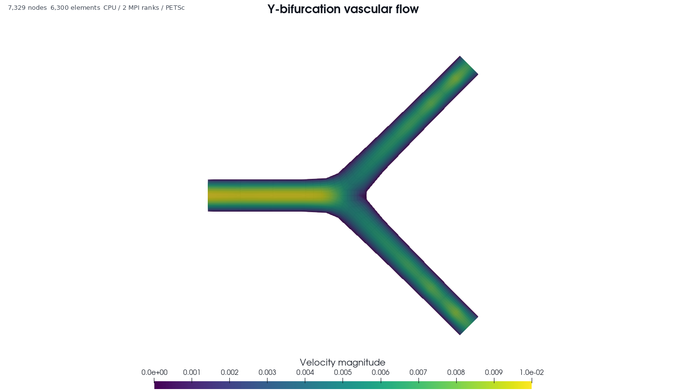
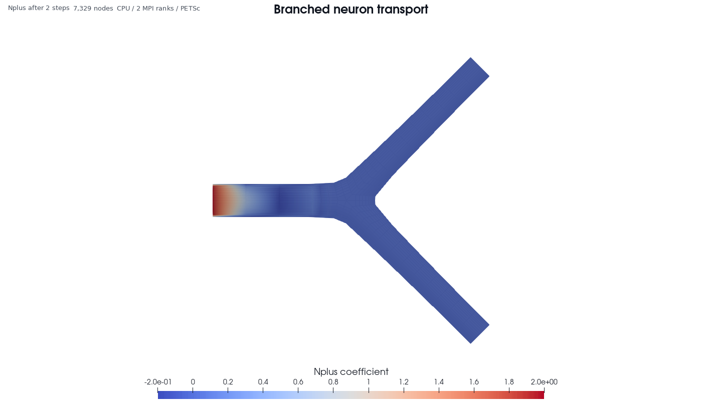

# TubularFlowIGA

TubularFlowIGA is a C++ isogeometric-analysis (IGA) pipeline for three-dimensional
flow and transport in tubular and branching geometries. Starting from an SWC
centerline, it generates a hexahedral control mesh, constructs the spline and
Bezier representation, packs a partition-aware database, and solves on either
MPI/PETSc CPUs or one CUDA GPU.

This is research software specialized for tube-like networks. It is not a
general-purpose CFD package.

## What can it simulate?

| Application | Available now | Important boundary |
|---|---|---|
| Vascular flow | Rigid-wall steady and backward-Euler transient 3D incompressible Navier--Stokes; pulsatile inlet functions; pressure, R, RC, and RCR outlets | No compliant wall, FSI, or 1D vascular-network solver |
| Neuron transport | Configurable two-field `N0`/`Nplus` axonal transport on straight and branching neurites | This is material transport, not membrane voltage, action potentials, synapses, or network electrophysiology |
| Generic biological transport | One to many scalar advection--diffusion systems with linear coupling, volume sources, flux, Robin, and no-flux boundaries | Field names have no built-in physiology; VCA metabolism, blood-gas chemistry, and tissue models are not yet implemented |

CPU and CUDA use the same `simulation_config.json` schema and packed `.ntiga`
database. CUDA configured transport supports one through eight scalar fields.

## Example results

| 3D vascular flow | Neuron transport |
|---|---|
|  |  |
| Y-bifurcation steady flow: 7,329 nodes, 6,300 elements, relative mass imbalance `8.36e-8`. | Branched neurite after two transport steps: 7,329 nodes, 88 Krylov iterations, coefficient L2 `29.6961`. |

Both images were rendered headlessly with ParaView 5.13.1 from public CPU
examples run on two MPI ranks with PETSc 3.15.5. They show a center-plane,
piecewise-linear visualization of solution coefficients on `controlmesh.vtk`;
quantitative flow validation is evaluated from the packed IGA representation,
not inferred from image pixels. Reproduction commands are in the
[examples catalog](examples/README.md), and the exact run metrics are in the
[public-example validation report](examples/VALIDATION.md).

## Pipeline

```text
SWC centerline
  -> C++ smoothing and hexahedral control mesh
  -> controlmesh.vtk
  -> C++ spline and Bezier extraction
  -> bzmeshinfo.txt + spline_cache.igacache
  -> METIS partition + iga_pack
  -> partition-aware .ntiga database
  -> CPU (MPI/PETSc) or CUDA (single GPU)
  -> velocity, pressure, and transported fields
```

## Choose a first example

Every runnable example contains exactly three committed inputs:
`skeleton_initial.swc`, `mesh_parameter.txt`, and `simulation_config.json`.
Generated meshes, databases, and results are written to a separate work
directory.

| Goal | Recommended case | Command |
|---|---|---|
| First vascular run | Straight rigid vessel | `./scripts/prepare_example.sh vascular_flow/straight_tube` |
| Curved vascular geometry | Planar bend | `./scripts/prepare_example.sh vascular_flow/bent_tube` |
| Branching vascular flow | Symmetric bifurcation | `./scripts/prepare_example.sh vascular_flow/y_bifurcation` |
| First neuron run | Straight neurite | `./scripts/prepare_example.sh neuron_transport/straight_neurite` |
| Branching neuron transport | Branched neurite | `./scripts/prepare_example.sh neuron_transport/branched_neurite` |

See the [examples catalog](examples/README.md) for the input contract and case
descriptions.

## Five-minute preprocessing check

The shortest first run needs GNU Make, a C++ compiler, Eigen 3, OpenMP, and
METIS with `mpmetis`. PETSc and CUDA are not required merely to generate and
validate a database.

```bash
git clone https://github.com/EngineerEricXie/TubularFlowIGA.git
cd TubularFlowIGA

./scripts/check_dependencies.sh preprocessing

VASCULAR_WORK="$(mktemp -d /tmp/tubularflowiga-vascular.XXXXXX)"
RANKS=2 ./scripts/prepare_example.sh \
  vascular_flow/straight_tube "$VASCULAR_WORK"
```

The preparation script builds the dependency-free tools and runs mesh
generation, spline extraction, two-way METIS partitioning, database packing,
inspection, configuration validation, and boundary-label validation. A
successful run prints the work directory, database path, and matching CPU/CUDA
solver commands.

The prepared directory contains, among other generated files:

- `controlmesh.vtk`: labeled hexahedral control mesh;
- `bzmesh.vtk` and `bzmeshinfo.txt`: Bezier visualization and extraction data;
- `initial_velocityfield.txt`: generated spatial velocity profile;
- `straight_tube-2.ntiga`: packed solver database.

`prepare_example.sh` requires an empty work directory. Its default `RANKS=2`
is intentional because `mpmetis` does not create a one-partition output.

## Run on CPU with MPI/PETSc

PETSc must be built with the same MPI implementation used at runtime. After
setting `PETSC_DIR` and, when applicable, `PETSC_ARCH`:

```bash
./scripts/check_dependencies.sh cpu
make cpu-petsc PETSC_DIR="$PETSC_DIR" PETSC_ARCH="${PETSC_ARCH:-}"
```

Run the prepared vascular example with exactly the rank count used during
packing:

```bash
VASCULAR_DB="$VASCULAR_WORK/straight_tube-2.ntiga"

mpiexec -np 2 ./solvers/cpu/iga_mesh_check "$VASCULAR_DB"
mpiexec -np 2 ./solvers/cpu/iga_navier_stokes \
  "$VASCULAR_DB" "$VASCULAR_WORK" \
  --output "$VASCULAR_WORK/velocity-cpu.txt"

./solvers/cpu/iga_flow_validate \
  "$VASCULAR_DB" "$VASCULAR_WORK/velocity-cpu.txt"
```

For neuron transport, prepare the neuron case and run its named equation
system:

```bash
NEURON_WORK="$(mktemp -d /tmp/tubularflowiga-neuron.XXXXXX)"
RANKS=2 ./scripts/prepare_example.sh \
  neuron_transport/straight_neurite "$NEURON_WORK"
NEURON_DB="$NEURON_WORK/straight_neurite-2.ntiga"

mpiexec -np 2 ./solvers/cpu/iga_solve \
  "$NEURON_DB" "$NEURON_WORK" \
  --system neuron_transport \
  --output "$NEURON_WORK/neuron-cpu.txt"
```

The flow solver writes three velocity columns to the requested path and one
pressure column to the neighboring `.pressure` file. Configured transport
writes `node_id` followed by fields in configured order; the neighboring
`.fields` file records `N0` and `Nplus`.

## Run on one CUDA GPU

The CUDA backend does not require PETSc, but compilation requires the CUDA
Toolkit and runtime requires a compatible NVIDIA driver and GPU.

```bash
./scripts/check_dependencies.sh cuda
make cuda CUDA_ARCHS=89

./solvers/cuda/iga_cuda device-info
./solvers/cuda/iga_cuda mesh-check "$VASCULAR_DB"
./solvers/cuda/iga_cuda navier-stokes \
  "$VASCULAR_DB" "$VASCULAR_WORK" \
  --output "$VASCULAR_WORK/velocity-cuda.txt"

./solvers/cuda/iga_cuda solve \
  "$NEURON_DB" "$NEURON_WORK" \
  --system neuron_transport \
  --output "$NEURON_WORK/neuron-cuda.txt"
```

Set `CUDA_ARCHS` to the compute capability of the target GPU. For example,
V100 is `70` and RTX 4080 SUPER is `89`. In WSL, `nvidia-smi` confirms driver
access but does not install `nvcc`; see the [dependency guide](docs/DEPENDENCIES.md)
for native and Conda CUDA Toolkit options. The CUDA flow path also writes a VTK
file next to the requested text output.

## Build and test targets

```bash
make mesh
make mesh-test
make spline EIGEN_DIR=/path/to/eigen3
make cpu
make cpu-test

make cpu-petsc \
  PETSC_DIR=/path/to/petsc \
  PETSC_ARCH=your-petsc-arch

make cuda CUDA_ARCHS="70 80 89 90"
```

`make cpu` builds the PETSc-free packer, inspectors, validators, and reference
utilities. `make cpu-petsc` builds the MPI simulation executables. MATLAB and
the external TREES Toolbox are optional and are needed only to reproduce the
legacy reference workflow.

## Create or modify a case

1. Copy one complete directory from `examples/neuron_transport/` or
   `examples/vascular_flow/` to a work or case directory outside the repository.
2. Edit `skeleton_initial.swc` for the rooted centerline and radii.
3. Edit `mesh_parameter.txt` for smoothing, segment length, and refinement.
4. Edit `simulation_config.json` for fields, equations, time integration, and
   named boundary conditions.
5. Run the preparation pipeline, inspect positive Jacobians and boundary labels,
   then execute the matching solver.

The mesh generator assigns wall label 0, inlet label 1, and terminal outlet
labels starting at 2. Do not assume a branch label without checking
`iga_case_check` output.

The spline stage translates coordinates by the domain minima and divides them
by the smallest domain-axis extent before writing the IGA representation.
Consequently, the packed database uses normalized coordinates. Example
viscosity, density, time, velocity, and transport coefficients are internally
consistent numerical values, not automatic SI or patient-specific parameters.
Document and apply a complete nondimensionalization when interpreting a case
physically.

## Repository layout

- `examples/`: small source-only neuron, vascular, and validation cases.
- `preprocessing/mesh/`: dependency-free C++ SWC smoothing and control meshes.
- `meshgeneration/`: legacy MATLAB reference and template assets.
- `preprocessing/spline/`: C++11 spline construction and Bezier extraction.
- `solvers/cpu/`: C++17 packer, checks, MPI/PETSc flow, and transport.
- `solvers/cuda/`: FP64 single-GPU backend using the CPU database format.
- `docs/`: installation, pipeline, configuration, and validation.

Large cases and generated results are intentionally not versioned.

## Documentation map

| Need | Document |
|---|---|
| Fresh-clone walkthrough | [Quick start](docs/QUICKSTART.md) |
| Linux, WSL, PETSc, MPI, CUDA, and Bridges-2 setup | [Dependencies](docs/DEPENDENCIES.md) |
| Files produced at every pipeline stage | [Pipeline](docs/PIPELINE.md) |
| Fields, operators, time stepping, and solver CLI | [PDE configuration](docs/PDE_CONFIGURATION.md) |
| Boundary labels and supported conditions | [Boundary conditions](docs/BOUNDARY_CONDITIONS.md) |
| CPU solver details | [CPU solver README](solvers/cpu/README.md) |
| CUDA solver details | [CUDA solver README](solvers/cuda/README.md) |
| PSC Bridges-2 scheduler workflow | [Bridges-2](docs/BRIDGES2.md) |
| Numerical evidence and limitations | [Benchmarks](docs/BENCHMARKS.md) |

## Validation status and limitations

The public straight, bent, and Y-shaped meshes have positive sampled
Jacobians. Representative CPU/CUDA transport and steady-flow comparisons,
mass-balance results, restart checks, and a rigid straight-tube Womersley gate
are recorded in the [vascular example validation](examples/vascular_flow/VALIDATION.md),
[CPU validation](solvers/cpu/VALIDATION.md), and
[CUDA validation](solvers/cuda/VALIDATION.md).

Current scope limits are important when interpreting results:

- vessel and neurite walls are geometrically rigid;
- pulsatile rigid-wall flow is supported, but compliant-wall pulse-wave
  propagation and FSI are not;
- R, RC, and RCR outlets are zero-dimensional circuits, not a 1D flow solver;
- generic scalar transport is not automatically a validated physiology model;
- the packed IGA geometry is normalized, so physical interpretation requires a
  documented dimensional scaling;
- HexSim-style VCA RBC/PFC chemistry and metabolism are not implemented;
- neuron transport is not neuron electrophysiology.

For shared clusters, run simulations on allocated compute resources rather
than login nodes and follow the local scheduler policy.

## Performance evidence

On the corrected 35,949-node `NMO_54499_new` case, one V100 completed coupled
Navier--Stokes plus 300-step transport numerical work in 279.40 s versus
563.68 s on 16 CPU ranks (2.02x). CPU and CUDA velocity, pressure, and transport
relative L2 differences were `5.33e-6`, `6.07e-6`, and `7.56e-6`.

Here **legacy** refers to the original
[NeuronTransportIGA](https://github.com/EngineerEricXie/NeuronTransportIGA).
See [BENCHMARKS.md](docs/BENCHMARKS.md) for hardware, timings, comparison scope,
and interpretation limits.

## License

TubularFlowIGA is distributed under the [BSD 3-Clause License](LICENSE).
