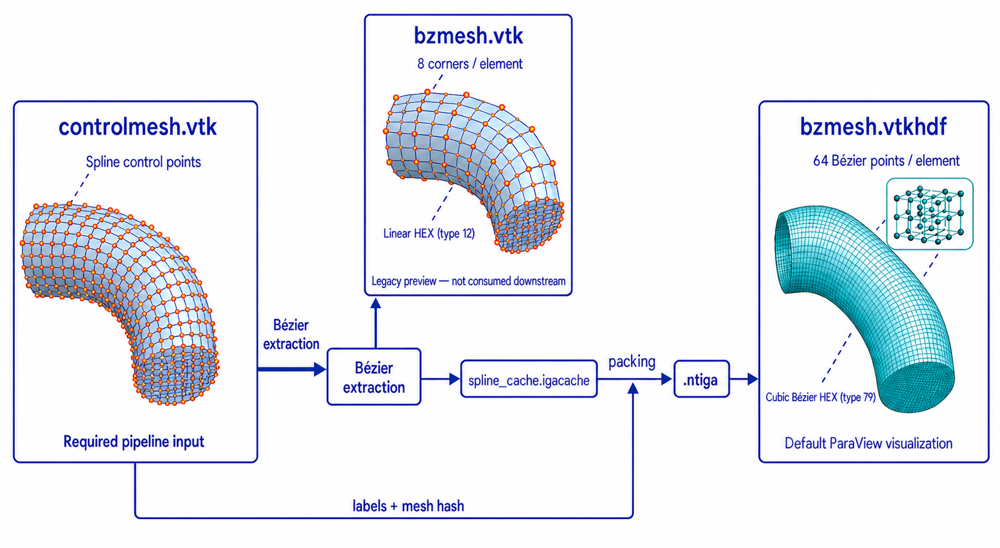

# Visualization output

CPU and CUDA production solvers use the same visualization formats. Text field
and checkpoint outputs are independent of this selection.

## Default format

`--visualization-format auto` is the default:

| Simulation | Visualization result |
| --- | --- |
| Transient flow or transport | Temporal `<output-stem>.vtkhdf` |
| Steady flow | Final `<output-stem>.vtu` |

Use `--visualization-format vtkhdf` or `--visualization-format vtu` to override
the automatic choice. `--output-every N` controls transient snapshots. The
initialized state is timestep zero.

## Temporal Bézier VTKHDF



The drawing is schematic. The actual control mesh sweeps the repository's
201-point, all-quadrilateral disk template along the centerline to form
hexahedral cells. It is not a tetrahedral mesh: there are no triangular surface
faces or diagonal front-to-back layer connections. The control mesh is the
required spline input. `bzmesh.vtk` is an optional eight-corner linear-HEX
preview and is not consumed downstream; the default cubic `bzmesh.vtkhdf`
visualization is reconstructed from the packed `.ntiga` database using all 64
Bézier points per element.

The VTKHDF file contains cubic `VTK_BEZIER_HEXAHEDRON` cells. Points,
connectivity, cell types, element IDs, partition owners, and higher-order
degrees are stored once. Each timestep appends only compressed point arrays and
step metadata, so geometry is not repeated across time.

Boundary metadata from the packed database is also stored once:

- PointData `boundary_label` marks Bézier face points for direct surface
  coloring (`-1` is interior, `0` is wall, and positive values are configured
  inlet/outlet labels). At a cap rim, the wall label takes precedence, matching
  `controlmesh.vtk`; `-2` denotes a junction between distinct non-wall labels.
- CellData `boundary_label` is `-1` for an interior element, the label when all
  of its boundary faces agree, and `-2` when the element touches multiple
  boundary labels.
- CellData `boundary_face_labels` preserves the exact six face labels in the
  database face order; `-1` denotes an interior face.

In ParaView, select Point Data `boundary_label` in **Color By** to see the wall,
inlet, and outlets on the curved Bézier surface. Use the cell arrays when
inspecting individual elements or exact face metadata.

The point arrays are obtained by applying each extraction column to the control
point solution. A global extraction-signature registry gives shared Bézier
points one visualization point ID. Coordinate equality alone never merges
points with different solution-space identities. `controlmesh.vtk` is not
rewritten and remains the canonical preprocessing/pipeline interface.
Before writing, the geometry is mapped from the normalized `.ntiga` coordinate
system back to source coordinates using its version-5 geometry transform. The
preprocessing preview, transient VTKHDF, and legacy VTU output therefore align
when loaded together with `controlmesh.vtk`. Version-3 and version-4 databases
lack this metadata and retain their historical identity transform.

To inspect that same cubic geometry before solving, export the packed database:

```bash
./solvers/cpu/iga_bezier_export DATABASE.ntiga CASE_DIR/bzmesh.vtkhdf
```

This produces a geometry-only dataset with no solution arrays. The example
preparation script performs the export automatically.

## Geometry report

Before VTKHDF creation, `<output-stem>.bezier_geometry.json` records:

- element-local and unique point counts;
- shared extraction-signature references;
- coordinate coincidences with different signatures;
- small coordinate repairs caused by legacy `%.6g` cache quantization;
- collapsed element points and sampled non-positive Jacobians;
- bounding-box overlap candidates and volume overlaps confirmed by inverse
  mapping.

Jacobian and overlap checks use the final merged visualization coordinates.
Invalid geometry prevents VTKHDF creation. Candidate counts are retained
separately so bounding-box contact is not reported as confirmed volume overlap.
VTKHDF files written before this source-coordinate change have a different
geometry hash and must be recreated rather than resumed in place.

## Restart behavior

Checkpoint restart resumes an existing VTKHDF only when its static geometry
hash and point-array schema match the current database and configuration.
Interrupted uncommitted rows are truncated to the recorded step count. Writing
the same final physical time replaces that timestep rather than duplicating it.

## Validation

The HDF5 schema regression is part of `make cpu-test`. With ParaView `pvpython`
installed, run the actual reader test:

```bash
make -C solvers/cpu vtkhdf-paraview-test
```
