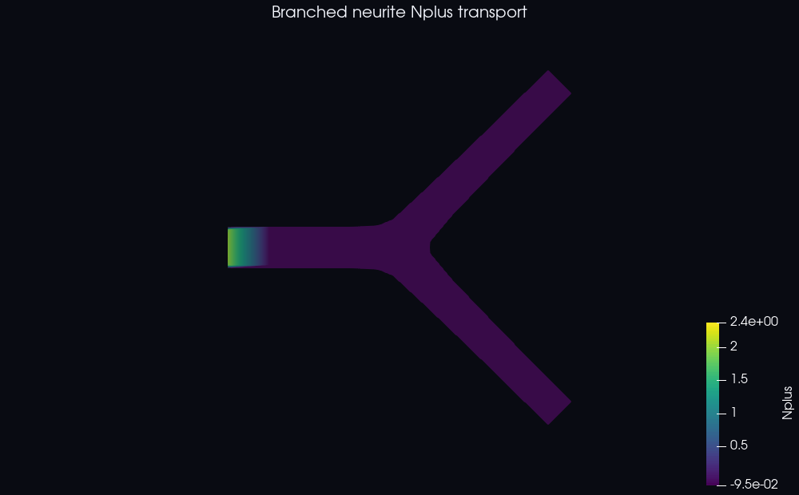

# Neuron-transport examples

These cases solve the legacy two-field axonal material-transport model through
the generic scalar PDE backend. They do not solve membrane voltage, action
potentials, synapses, or network electrophysiology.

## Cases

| Case | Geometry | Boundary labels |
|---|---|---|
| `straight_neurite` | Short constant-radius neurite | wall 0, inlet 1, outlet 2 |
| `branched_neurite` | One parent splitting into two arms | wall 0, inlet 1, outlets 2 and 3 |
| `nmo_06840_bifurcation` | Large NeuroMorpho-derived bifurcation | wall 0, inlet 1, outlets 2 and 3 |

All three configurations solve `N0` and `Nplus`. `N0` diffuses, `Nplus` uses the
generated `initial_velocityfield.txt` for advection, and linear coupling
transfers mass between the fields. The `branched_neurite` showcase and large
NMO regression also configure `Nplus` diffusion to reduce pure-advection
oscillation. Walls are no-flux, label 1 prescribes both inlet values, and
terminal labels use advective outflow.

## Large NMO transport regression

The schema-v4 `nmo_06840_bifurcation` input produces 41,097 control points and
36,540 elements. Its cache and database are each about 365 MiB, so preparation and
the two-step transport solve can take many minutes on a slower workstation.
It is not an installation smoke test.

See the [case README](nmo_06840_bifurcation/README.md) for resource estimates,
12-rank CPU and single-GPU commands, output details, validation evidence,
NeuroMorpho.Org attribution, and scientific limitations.

## Branched transport result



The animation contains the initialized `t=0` field and 40 solved states through
`t=4`. The inlet fixes `Nplus=2`; diffusion, prescribed advection, and coupling
move the field down the parent and into both child branches. The final Nplus
range was approximately `9.16e-4` to `2.363`, with mean `0.450`. A short early
transient reached `-0.095`, so this remains a numerical transport showcase and
must not be interpreted as a positivity-preserving biological calibration.

## Prepare and run on CPU

From the repository root:

```bash
NEURON_SOURCE=examples/neuron_transport/straight_neurite
./scripts/generate_case.sh "$NEURON_SOURCE" --ranks 2
NEURON_WORK="$NEURON_SOURCE/generated"
NEURON_CASE="$NEURON_WORK/preprocessing"
NEURON_DB="$NEURON_WORK/database/straight_neurite-2.ntiga"
NEURON_RESULTS="$NEURON_WORK/results"

mpiexec -np 2 ./solvers/cpu/iga_solve \
  "$NEURON_DB" "$NEURON_CASE" \
  --system neuron_transport \
  --output "$NEURON_RESULTS/neuron-cpu.txt" --output-every 1
```

Build the MPI/PETSc solver first if `solvers/cpu/iga_solve` is absent:

```bash
make cpu-petsc PETSC_DIR="$PETSC_DIR" PETSC_ARCH="${PETSC_ARCH:-}"
```

The result has one row per database node: `node_id N0 Nplus`. The neighboring
`neuron-cpu.txt.fields` file records the field order. Add `--output-every 1` to
write `neuron-cpu.pvd`, its initialized step, and every solved VTU snapshot.

Reproduce the branched-neurite GIF from the repository root with:

```bash
BRANCHED_SOURCE=examples/neuron_transport/branched_neurite
./scripts/generate_case.sh "$BRANCHED_SOURCE" --ranks 8
BRANCHED_WORK="$BRANCHED_SOURCE/generated"
BRANCHED_CASE="$BRANCHED_WORK/preprocessing"
BRANCHED_DB="$BRANCHED_WORK/database/branched_neurite-8.ntiga"
BRANCHED_RESULTS="$BRANCHED_WORK/results"

mpiexec -np 8 ./solvers/cpu/iga_solve \
  "$BRANCHED_DB" "$BRANCHED_CASE" --system neuron_transport \
  --output "$BRANCHED_RESULTS/neuron-cpu.txt" --output-every 1

pvbatch --force-offscreen-rendering scripts/render_transport_gif.py \
  --input "$BRANCHED_RESULTS/neuron-cpu.pvd" --array Nplus \
  --output docs/images/neuron-branched-transport.gif \
  --title "Branched neurite Nplus transport" --frames 13
```

## Run on CUDA

```bash
./solvers/cuda/iga_cuda solve \
  "$NEURON_DB" "$NEURON_CASE" \
  --system neuron_transport \
  --output "$NEURON_RESULTS/neuron-cuda.txt"
```

Build with `make cuda CUDA_ARCHS=YOUR_GPU_ARCH` and verify
`./solvers/cuda/iga_cuda device-info` before running. CPU and CUDA use the same
case configuration and `.ntiga` database.

## Customize

- Change geometry and radius in `skeleton_initial.swc`.
- Change adaptive discretization, junction, and quality controls in the `mesh`
  block of `simulation_config.json`.
- Change diffusivity, coupling coefficients, time step, inlet values, or number
  of steps in the same file.

Field names and coefficients are explicit configuration values; the solver
does not silently apply additional neuron biology. See the
[PDE configuration guide](../../docs/PDE_CONFIGURATION.md) before adding terms.
