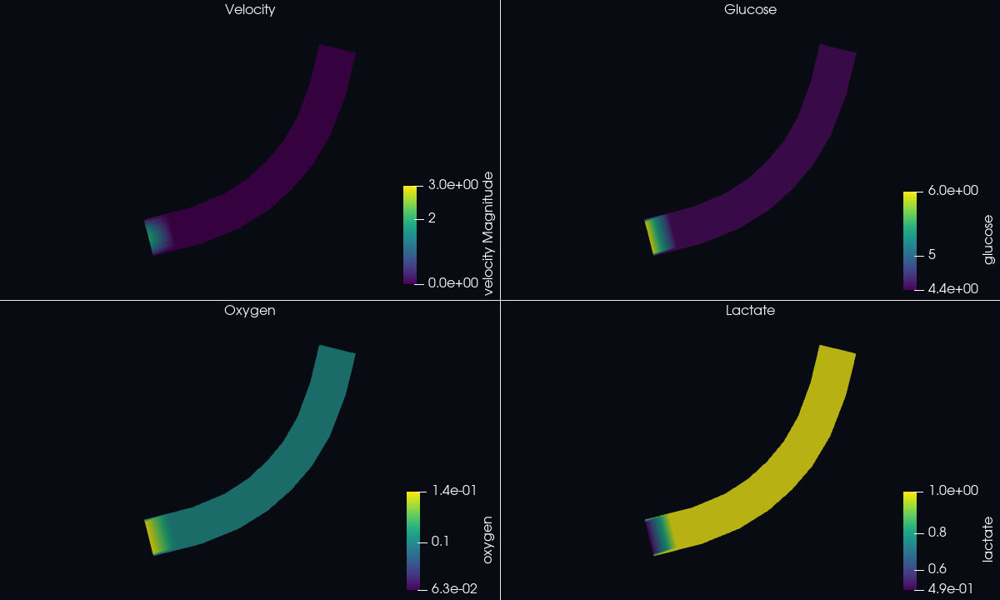

# Vascular-flow examples

These small cases solve steady, rigid-wall, three-dimensional incompressible
Navier--Stokes flow. They are intended for first runs, boundary-condition
checks, and CPU/CUDA correctness comparisons rather than physiological
calibration.

## Cases

| Case | Geometry | Boundary labels |
|---|---|---|
| `straight_tube` | Short constant-radius vessel | wall 0, inlet 1, outlet 2 |
| `bent_tube` | Planar quarter bend | wall 0, inlet 1, outlet 2 |
| `y_bifurcation` | One inlet splitting into two arms | wall 0, inlet 1, outlets 2 and 3 |
| `iga_wordmark` | Connected IGA-letter showcase pipe | wall 0, inlet 1, outlet 2 |
| `multispecies_pulse` | Curved pulse-driven multiphysics showcase | wall 0, inlet 1, outlet 2 |
| `liver_vein_obj_segment` | Vertices 1–12 from the radius-annotated liver OBJ | wall 0, inlet 1, outlet 2 |

## Results

| Steady-state Y-bifurcation | Transient multispecies pulse |
|---|---|
|  |  |
| The two outlets carry nearly equal outward flow in the symmetric rigid-wall geometry. | The fixed time-series color ranges show the pulse velocity and three concentration fronts over `t=0` through `t=8`. |

`straight_tube`, `bent_tube`, `y_bifurcation`, `iga_wordmark`, and
`liver_vein_obj_segment` are steady-state flow cases. They solve velocity and
pressure without a physical-time loop. `multispecies_pulse` is deliberately
different: it first solves transient flow, then transports six scalar species
with those velocity snapshots.

Except for `multispecies_pulse`, each configuration contains only the
`blood_flow` system with velocity and pressure fields. Walls are no-slip, the
generated inlet profile is multiplied by scale `0.01` in the three simple
geometries, and outlets use zero natural pressure traction. The wordmark
instead uses scale `0.005` and density `1e-5` as a Stokes-limit visualization
case. These values are numerical example parameters, not patient-specific
blood calibration.

`multispecies_pulse` is the intentional exception. It combines transient
Navier--Stokes with config-selected oxygen, glucose, lactate, carbon dioxide,
bicarbonate, and vasodilator transport, metabolism, Robin oxygen exchange, and
derived blood-gas arrays. Its eight-second pulse and inlet scale are selected
so the animation covers roughly one advective transit through the example;
they are numerical showcase units, not calibrated blood parameters. Run flow
first so it writes
`flow_velocity.series.csv`, then run the named transport system:

```bash
RANKS=8 ./scripts/prepare_example.sh \
  vascular_flow/multispecies_pulse "$MULTISPECIES_WORK"
DB="$MULTISPECIES_WORK/multispecies_pulse-8.ntiga"

mpiexec -np 8 ./solvers/cpu/iga_navier_stokes "$DB" "$MULTISPECIES_WORK" \
  --output "$MULTISPECIES_WORK/flow_velocity.txt" --output-every 1
mpiexec -np 8 ./solvers/cpu/iga_solve "$DB" "$MULTISPECIES_WORK" \
  --system multispecies_physiology_3d \
  --output "$MULTISPECIES_WORK/multispecies.txt" --output-every 1
```

The resulting `.pvd` files open directly in ParaView. Reproduce the README GIF
from the repository root with:

```bash
pvbatch scripts/render_multiphysics_gif.py --dimension 3d \
  --flow "$MULTISPECIES_WORK/flow_velocity.pvd" \
  --transport "$MULTISPECIES_WORK/multispecies.pvd" \
  --output docs/images/multispecies-3d-pulse.gif \
  --title "3D pulse multispecies physiology" --frames 9
```

## Run the README wordmark

The wordmark is larger than the quick-start cases. Its two connector arcs move
behind the lettering in the z direction, producing one continuous 3D pipe
without planar self-intersections.

```bash
IGA_WORK="$(mktemp -d /tmp/tubularflowiga-iga-wordmark.XXXXXX)"
RANKS=2 ./scripts/prepare_example.sh \
  vascular_flow/iga_wordmark "$IGA_WORK"
IGA_DB="$IGA_WORK/iga_wordmark-2.ntiga"

PETSC_OPTIONS="-ksp_type fgmres -ksp_gmres_restart 200 \
-pc_type asm -pc_asm_overlap 2 -sub_pc_type ilu \
-sub_pc_factor_levels 1" \
mpiexec -np 2 ./solvers/cpu/iga_navier_stokes \
  "$IGA_DB" "$IGA_WORK" --max-newton 6 \
  --output "$IGA_WORK/velocity-cpu.txt"

./solvers/cpu/iga_flow_validate \
  "$IGA_DB" "$IGA_WORK/velocity-cpu.txt"
```

The validated 2026-08-25 run used 24,924 nodes and 22,140 elements, converged
in 1,304 total Krylov iterations, and reached relative mass imbalance
`9.79398e-8`. See the [public validation report](../VALIDATION.md) for the
remaining norms and timing.

Spline extraction normalizes the domain coordinates before packing. Treat the
committed values as a numerical smoke configuration; a physiological study
must define a consistent length, time, velocity, pressure, density, and
viscosity scaling.

## Prepare and run on CPU

From the repository root:

```bash
VASCULAR_WORK="$(mktemp -d /tmp/tubularflowiga-vascular.XXXXXX)"
RANKS=2 ./scripts/prepare_example.sh \
  vascular_flow/straight_tube "$VASCULAR_WORK"
VASCULAR_DB="$VASCULAR_WORK/straight_tube-2.ntiga"

mpiexec -np 2 ./solvers/cpu/iga_mesh_check "$VASCULAR_DB"
mpiexec -np 2 ./solvers/cpu/iga_navier_stokes \
  "$VASCULAR_DB" "$VASCULAR_WORK" \
  --output "$VASCULAR_WORK/velocity-cpu.txt"

./solvers/cpu/iga_flow_validate \
  "$VASCULAR_DB" "$VASCULAR_WORK/velocity-cpu.txt"
```

Build the MPI/PETSc solver first if `solvers/cpu/iga_navier_stokes` is absent:

```bash
make cpu-petsc PETSC_DIR="$PETSC_DIR" PETSC_ARCH="${PETSC_ARCH:-}"
```

The requested output contains three velocity columns per node. Pressure is in
the neighboring `velocity-cpu.txt.pressure` file. `iga_flow_validate` reports
flow on every boundary, net outward flow, relative mass imbalance, volume
divergence, and divergence-theorem error.

## Run on CUDA

```bash
./solvers/cuda/iga_cuda mesh-check "$VASCULAR_DB"
./solvers/cuda/iga_cuda navier-stokes \
  "$VASCULAR_DB" "$VASCULAR_WORK" \
  --output "$VASCULAR_WORK/velocity-cuda.txt"
```

Build with `make cuda CUDA_ARCHS=YOUR_GPU_ARCH` and verify
`./solvers/cuda/iga_cuda device-info` before running. CUDA additionally writes
`velocity-cuda.txt.vtk` for direct visualization.

## Customize

- Change centerline coordinates and radii in `skeleton_initial.swc` or the
  radius-annotated `skeleton_initial.obj` used by `liver_vein_obj_segment`.
- Change segment length, smoothing, or bifurcation refinement in
  `mesh_parameter.txt`.
- Change viscosity, density, time integration, inlet profile scale, temporal
  functions, or outlet models in `simulation_config.json`.

These geometries are rigid. A time-dependent inlet produces pulsatile
rigid-wall flow, not compliant-wall pulse-wave propagation. See the
[boundary-condition guide](../../docs/BOUNDARY_CONDITIONS.md) and
[PDE configuration guide](../../docs/PDE_CONFIGURATION.md) before changing the
physics.

Measured geometry, flow, mass-balance, and CPU/CUDA results are recorded in
[`VALIDATION.md`](VALIDATION.md). Its tracer table is retained as historical
evidence from before application-specific example configurations were split.
